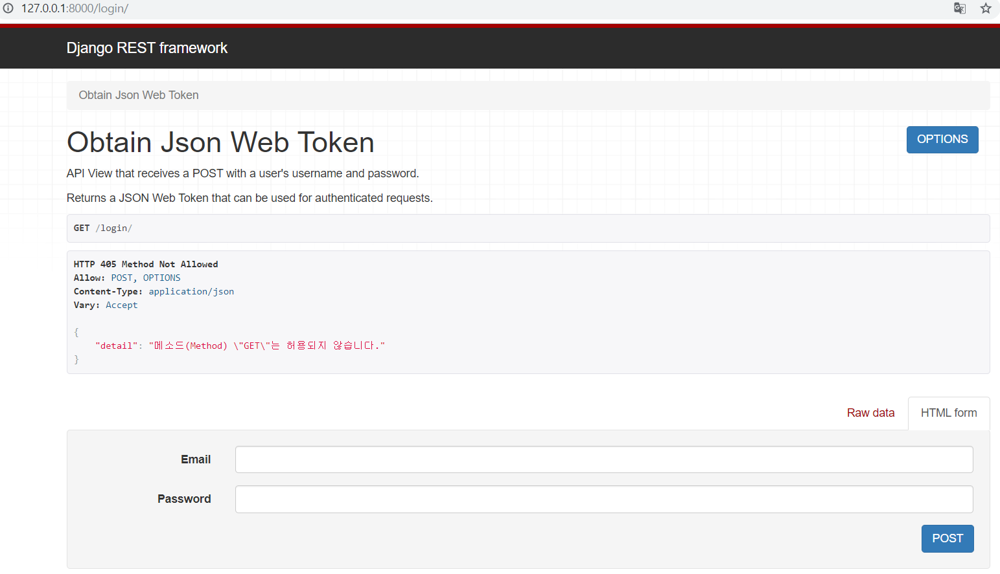
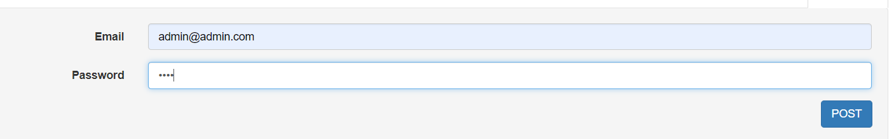
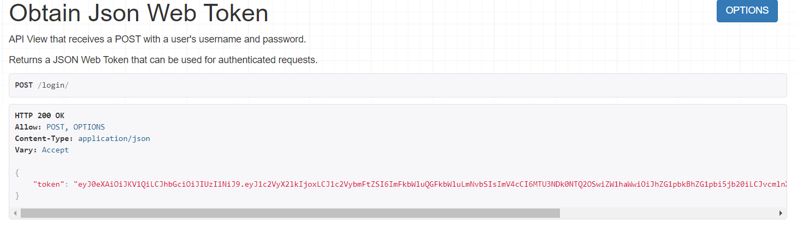
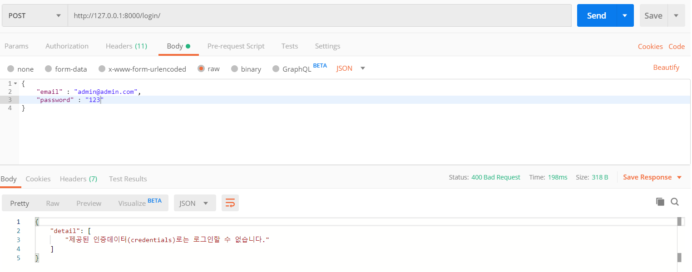
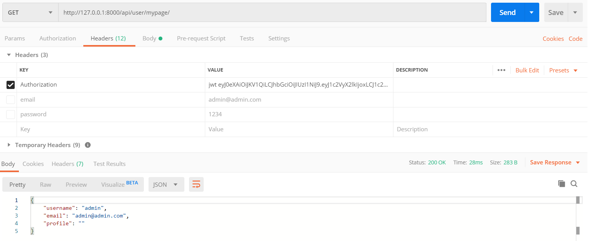

# JWT-Authentication

- `pip install list`
    ```bash
    $ pip install django
    $ pip install djangorestframework
    $ pip install django-cors-headers
    $ pip install djangorestframework-jwt
    ```

## 1. 인증 과정

### 1.1 로그인 화면

- DRF에서 제공하는 화면



### 1.2 로그인



- 로그인 결과 반환값



- 포스트맨에서의 로그인 테스트(성공시)

  

- 포스트맨에서의 로그인 테스트(실패시)

  

### 1.3 토큰 활용 방법



- `headers`에 `Authorization`에 토큰값을 넣는다.
  - 토큰값을 넣는데 맨 앞에 `JWT`를 붙이자
- 이제 `JWT`를 이용해서 사용자의 정보를 인증하여 정보를 가져올 수 있다.